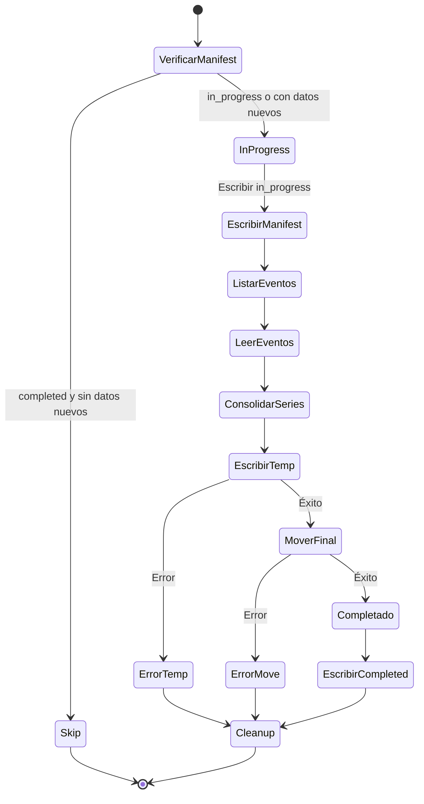
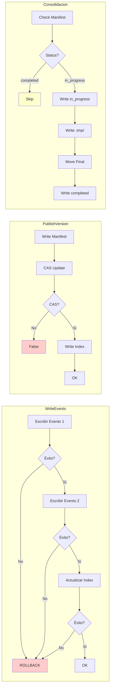

# Diagramas del Pipeline

## 1. Diagrama de Flujo Completo

Este diagrama muestra el flujo completo del pipeline con todas las casuísticas, decisiones, rollbacks y verificaciones.

```mermaid
flowchart TD
    Start([Inicio Pipeline]) --> Init[Inicializar Infraestructura]
    Init --> Lock{Lock Manager?}
    Lock -->|Sí| AcquireLock[Adquirir Lock DynamoDB]
    Lock -->|No| VerifyConsistency
    AcquireLock --> LockAcquired{Lock Adquirido?}
    LockAcquired -->|No| End1([Fin: Ya corriendo])
    LockAcquired -->|Sí| VerifyConsistency
    VerifyConsistency[Verificar Consistencia Pointer-Index] --> Consistent{Consistente?}
    Consistent -->|No| RebuildIndex[Rebuild Index desde Pointer]
    Consistent -->|Sí| FetchResource
    RebuildIndex --> FetchResource[Fetch Resource]
    FetchResource --> CheckSource[Check Source Changed]
    CheckSource --> SourceChanged{Source Cambió?}
    SourceChanged -->|No| End2([Fin: Sin cambios])
    SourceChanged -->|Sí| ParseFile[Parse File]
    ParseFile --> FilterNew[Filter New Data]
    FilterNew --> HasNew{Has New Data?}
    HasNew -->|No| End3([Fin: Sin datos nuevos])
    HasNew -->|Sí| Normalize[Normalize Rows]
    Normalize --> ComputeDelta[Compute Delta]
    ComputeDelta --> EnrichMetadata[Enrich Metadata]
    EnrichMetadata --> WriteEvents[Write Events]
    WriteEvents --> WriteSuccess{Éxito?}
    WriteSuccess -->|No| RollbackEvents[ROLLBACK: Eliminar eventos]
    WriteSuccess -->|Sí| UpdateEventIndex[Actualizar Event Index]
    UpdateEventIndex --> IndexSuccess{Éxito?}
    IndexSuccess -->|No| RollbackEvents
    IndexSuccess -->|Sí| PublishVersion
    RollbackEvents --> End4([Fin: Error])
    PublishVersion{rows_added > 0?} -->|No| End5([Fin: 0 rows])
    PublishVersion -->|Sí| BuildManifest[Build Manifest]
    BuildManifest --> WriteEventManifest[Write Event Manifest]
    WriteEventManifest --> CASUpdate[CAS Update Pointer]
    CASUpdate --> CASSuccess{CAS Exitoso?}
    CASSuccess -->|No| End6([Fin: CAS falló])
    CASSuccess -->|Sí| WriteIndex[Write Index]
    WriteIndex --> Published[Published = True]
    Published --> Consolidate{Published = True?}
    Consolidate -->|Sí| ConsolidateProjection[Consolidate Projection]
    Consolidate -->|No| Notify
    ConsolidateProjection --> CheckManifest{Manifest completed?}
    CheckManifest -->|Sí y sin datos nuevos| SkipConsolidate[Skip Consolidación]
    CheckManifest -->|No o con datos nuevos| WriteInProgress[Write Manifest in_progress]
    WriteInProgress --> ListEvents[List Events for Month]
    ListEvents --> ReadEvents[Read Events]
    ReadEvents --> ConsolidateSeries[Consolidate Series]
    ConsolidateSeries --> WriteTemp[Write to .tmp/]
    WriteTemp --> MoveFromTemp[Move to Final]
    MoveFromTemp --> WriteCompleted[Write Manifest completed]
    WriteCompleted --> Cleanup[Cleanup .tmp/]
    Cleanup --> Notify
    SkipConsolidate --> Notify
    Notify{Published = True?} -->|Sí| NotifyConsumers[Notify Consumers]
    Notify -->|No| End7([Fin Pipeline])
    NotifyConsumers --> End7
    End1 --> End7
    End2 --> End7
    End3 --> End7
    End5 --> End7
    End6 --> End7
    
    style RollbackEvents fill:#ffcccc
    style RebuildIndex fill:#ffffcc
    style CASUpdate fill:#ccffcc
    style ConsolidateProjection fill:#ccccff
```



## 2. Diagrama de Secuencia Completo

Este diagrama muestra la secuencia completa de operaciones entre todos los componentes del pipeline.

```mermaid
sequenceDiagram
    participant Trigger as Trigger/Scheduler
    participant Pipeline as Pipeline Runner
    participant Lock as DynamoDB Lock
    participant Catalog as S3Catalog
    participant S3 as S3 Storage
    participant Parser as Parser Plugin
    participant Normalizer as Normalizer Plugin
    participant Publisher as SNS Publisher
    
    Trigger->>Pipeline: Ejecutar Pipeline
    Pipeline->>Lock: acquire(lock_key, run_id)
    alt Lock configurado
        Lock-->>Pipeline: Lock adquirido / Ya corriendo
        alt Lock ya adquirido
            Pipeline-->>Trigger: Pipeline ya corriendo
        end
    end
    
    alt Lock adquirido o no configurado
        Pipeline->>Catalog: verify_pointer_index_consistency()
        Catalog->>S3: read_current_manifest()
        S3-->>Catalog: Manifest pointer
        Catalog->>S3: read_event_manifest()
        S3-->>Catalog: Event manifest
        Catalog->>S3: read_index()
        S3-->>Catalog: Index DataFrame
        Catalog-->>Pipeline: Consistente / Inconsistente
        
        alt Inconsistente detectada
            Pipeline->>Catalog: rebuild_index_from_pointer()
            Catalog->>S3: list_objects(events/)
            S3-->>Catalog: Lista de eventos
            loop Por cada versión hasta current
                Catalog->>S3: read_parquet(event)
                S3-->>Catalog: Event DataFrame
            end
            Catalog->>Catalog: compute_key_hash()
            Catalog->>S3: write_index()
            Catalog-->>Pipeline: Índice reconstruido
        end
        
        Pipeline->>S3: fetch_resource(url)
        S3-->>Pipeline: Contenido del archivo
        
        Pipeline->>Catalog: check_source_changed(content)
        Catalog->>S3: read_current_manifest()
        S3-->>Catalog: Manifest actual
        Catalog->>Catalog: compute_file_hash(content)
        Catalog-->>Pipeline: Cambió / No cambió
        
        alt Source cambió
            Pipeline->>Parser: parse_file(content, config)
            Parser-->>Pipeline: parsed_df
            
            Pipeline->>Catalog: filter_new_data(parsed_df)
            Catalog->>S3: read_index()
            S3-->>Catalog: Index DataFrame
            Catalog->>Catalog: filter_by_date()
            Catalog-->>Pipeline: new_df
            
            alt Hay datos nuevos
                Pipeline->>Normalizer: normalize_rows(new_df, config)
                Normalizer-->>Pipeline: normalized_df
                
                Pipeline->>Catalog: compute_delta(normalized_df)
                Catalog->>S3: read_index()
                S3-->>Catalog: current_index_df
                Catalog->>Catalog: anti_join()
                Catalog->>Catalog: compute_key_hash()
                Catalog-->>Pipeline: delta_df, current_index_df
                
                Pipeline->>Pipeline: enrich_metadata(delta_df)
                
                Pipeline->>Catalog: write_events(version_ts, enriched_delta_df)
                loop Por cada partición año/mes
                    Catalog->>S3: put_object(event_file)
                    alt Error
                        S3-->>Catalog: Error
                        Catalog->>S3: delete_object(eventos_escritos)
                        Catalog-->>Pipeline: Excepción
                    else Éxito
                        S3-->>Catalog: OK
                    end
                end
                Catalog->>S3: write_event_index()
                Catalog-->>Pipeline: event_keys, rows_added
                
                alt Error en write_events
                    Pipeline-->>Trigger: Error: Rollback completado
                else Éxito
                    Pipeline->>Catalog: publish_version(...)
                    Catalog->>Catalog: build_manifest()
                    Catalog->>S3: write_event_manifest()
                    Catalog->>S3: put_current_manifest_pointer(if_match=etag)
                    
                    alt CAS falló
                        S3-->>Catalog: Error 412
                        Catalog-->>Pipeline: Published = False
                    else CAS exitoso
                        S3-->>Catalog: OK
                        Catalog->>S3: write_index()
                        Catalog-->>Pipeline: Published = True
                        
                        alt Published = True
                            Pipeline->>Catalog: consolidate_projection(enriched_delta_df)
                            loop Por cada mes afectado
                                Catalog->>Catalog: read_consolidation_manifest()
                                alt Manifest completed y sin datos nuevos
                                    Catalog-->>Pipeline: Skip consolidación
                                else Consolidar
                                    Catalog->>Catalog: write_consolidation_manifest(in_progress)
                                    Catalog->>Catalog: list_events_for_month()
                                    Catalog->>S3: read_event_index()
                                    S3-->>Catalog: Event index
                                    loop Por cada versión en index
                                        Catalog->>S3: read_parquet(event)
                                        S3-->>Catalog: Event DataFrame
                                    end
                                    Catalog->>Catalog: consolidate_series()
                                    Catalog->>S3: write_series_projection_temp()
                                    Catalog->>S3: move_series_projection_from_temp()
                                    Catalog->>S3: write_consolidation_manifest(completed)
                                    Catalog->>S3: cleanup_temp_projections()
                                end
                            end
                            
                            Pipeline->>Publisher: notify_consumers(version_ts)
                            Publisher->>SNS: publish(topic_arn, message)
                        end
                    end
                end
            end
        end
        
        Pipeline->>Lock: release(lock_key, run_id)
    end
    
    Pipeline-->>Trigger: Pipeline completado
```



## 3. Diagrama de Frecuencia

Este diagrama muestra cuándo se ejecutan los diferentes procesos y verificaciones.

```mermaid
gantt
    title Frecuencia de Ejecución del Pipeline
    dateFormat X
    axisFormat %s
    
    section Cada Ejecución
    Verificar Consistencia    :0, 1s
    Adquirir Lock             :1s, 1s
    Fetch Resource            :2s, 3s
    Check Source Changed      :5s, 1s
    Parse File                :6s, 2s
    Filter New Data           :8s, 1s
    Normalize Rows            :9s, 2s
    Compute Delta             :11s, 2s
    Enrich Metadata           :13s, 1s
    Write Events              :14s, 5s
    Publish Version           :19s, 2s
    Consolidate Projection    :21s, 10s
    Notify Consumers          :31s, 1s
    Release Lock              :32s, 1s
    
    section Condicional
    Rebuild Index             :crit, 0, 30s
    Procesar Datos            :active, 5s, 28s
    Escribir Eventos          :active, 14s, 5s
    Consolidar                :active, 21s, 10s
    Notificar                 :active, 31s, 1s
    Rollback Events           :crit, 14s, 2s
```

## 4. Diagrama de Estados de Consolidación



## 5. Diagrama de Resiliencia



## Notas

### Puntos Clave

1. **Verificación Proactiva**: Al inicio, verifica consistencia pointer-index y reconstruye si es necesario
2. **Rollback Automático**: Si falla cualquier escritura de eventos, elimina todos los eventos escritos
3. **CAS Atómico**: El puntero se actualiza con Compare-And-Swap para evitar concurrencia
4. **WAL Pattern**: Las proyecciones se escriben primero a `.tmp/` y luego se mueven atómicamente
5. **Idempotencia**: La consolidación verifica el manifest antes de consolidar

### Casos de Error Cubiertos

- ✅ Fallo en escritura de eventos → Rollback automático
- ✅ Inconsistencia pointer-index → Reconstrucción automática
- ✅ Fallo en CAS → Datos huérfanos (no visibles)
- ✅ Fallo en consolidación → Cleanup y re-consolidación en próxima ejecución
- ✅ Fallo en notificación → Datos ya publicados, notificación opcional
